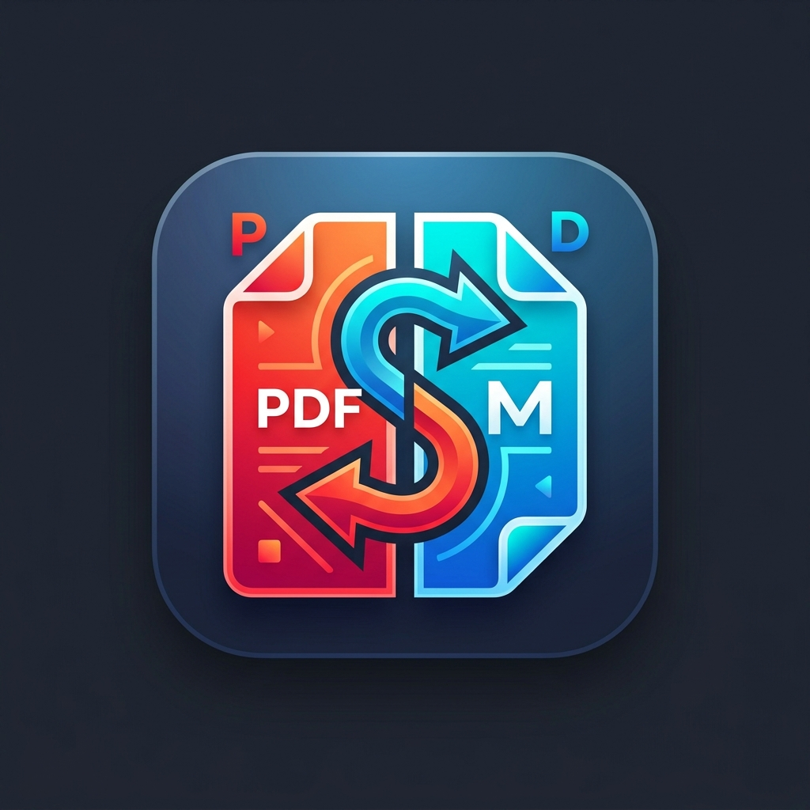

<div align="center">
  
  <h1>📑 Modern PDF Page Splitter & Merger GUI</h1>
</div>

Phần mềm Desktop GUI hiện đại bằng **Python (PyQt6 + PyMuPDF)** hỗ trợ nạp nhiều file PDF để **Tách trang tự động** và **Trộn/Ghép trang tùy chọn linh hoạt**. Hỗ trợ giao diện đa ngôn ngữ **Tiếng Việt 🇻🇳 & English 🇬🇧**.

---

## 🌟 Chức Năng Chính (Key Features)

- 📁 **Nạp File Linh Hoạt (Drag & Drop)**: Thêm từng file, thêm cả thư mục hoặc kéo thả trực tiếp file PDF vào ứng dụng.
- ✂ **Chế Độ 1: Tách Mỗi Trang Thành 1 File PDF (Split All Pages)**:
  - Tách tự động tất cả các trang thành các file đơn lẻ.
  - Tùy chọn phạm vi trang (ví dụ: `1-5, 8, 10`).
  - Định dạng tên file linh hoạt (`{name}_trang_{page}.pdf`) & tự động tạo thư mục con.
- 🧩 **Chế Độ 2: Trộn & Ghép Trang Tùy Chọn (Visual Custom Page Merger)**:
  - Hiển thị hình ảnh xem trước (Thumbnail Cards) của từng trang.
  - **Double-click phóng to** trang để xem chi tiết ở độ phân giải cao.
  - **Kéo thả sắp xếp thứ tự trang** trực tiếp trong danh sách ghép.
  - Chọn trang tùy ý từ nhiều file PDF khác nhau để tạo file PDF mới.
- 🌐 **Đa Ngôn Ngữ (i18n)**: Chuyển đổi tức thì giữa **Tiếng Việt** và **English**.

---

## 🛠 Hướng Dẫn Cài Đặt & Chạy Trực Tiếp (Installation & Run)

1. **Yêu cầu hệ thống**: Python 3.10+
2. **Cài đặt thư viện phụ thuộc**:
   ```bash
   pip install -r requirements.txt
   ```
3. **Khởi chạy ứng dụng**:
   ```bash
   python main.py
   ```

---

## 📦 Đóng Gói Thành File `.exe` (Packaging)

Chạy file batch đóng gói tự động trên Windows:
```bash
build_exe.bat
```
File `.exe` kết quả sẽ được tạo tại thư mục `dist/PDF_Splitter_Merger/PDF_Splitter_Merger.exe`.

---

## 📄 Giấy Phép (License)
Dự án được phát hành theo giấy phép MIT.
